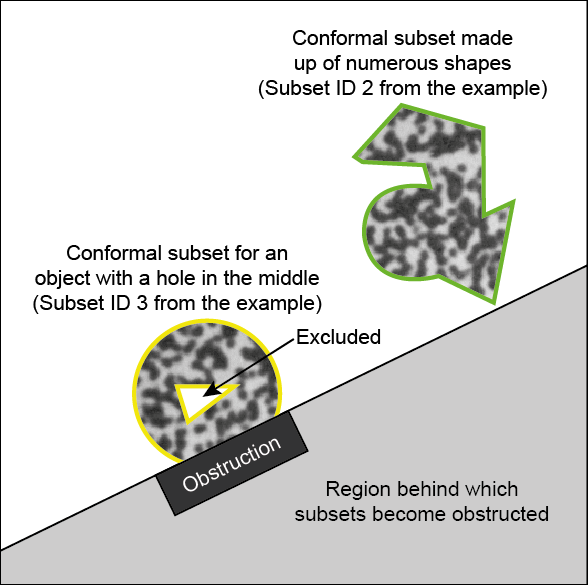

Copyright 2015 Sandia Corporation.  Under the terms of Contract DE-AC04-94AL85000 with Sandia Corporation,
the U.S. Government retains certain rights in this software.
SAND number for the information contained in the documentation and tutorials: SAND2015-10606 O

[DICe Home Page] (http://dice.sandia.gov)

[Getting Started] (#GettingStarted)

[User Manual] (#UserManual)

[Tutorial] (DICe_Tutorial.md)

[Obtaining DICe source code] (#DICeSource)

[Building DICe] (#BuildingDICe)

[Writing a custom DIC application with DICe] (DICe_CustomApplication.md)

[Legal] (#Legal)

Citing %DICe:

DZ Turner, Digital Image Correlation Engine (%DICe) Reference Manual, Sandia Report, SAND2015-10606 O, 2015.

Introduction
============

DICe is an open source digital image correlation (DIC) tool intended for use as a module in an 
external application or as a standalone analysis code. Its primary capability is
computing full-field displacements and strains from sequences of digital images. These
images are typically of a material sample undergoing a characterization
experiment, but DICe is also useful for other applications (for example, trajectory tracking and 
object classification). DICe is machine portable (Windows, Linux and Mac) and can be
effectively deployed on high performance computing platforms (DICe uses MPI parallelism as well as
threaded on-core parallelism). Capabilities from DICe can
be invoked through a customized library interface, via source code integration of DICe classes or
through a standalone executable from the command line.

DIC, in general, has become a popular means of determining full-field displacements from digital images,
it has also become a vital component in material characterization applications that use full-field
information as part of a parameter inversion process. DIC is also used extensively for constitutive 
model development and validation as well as physics code validation. DICe aims to enable more seamless integration of DIC in these types of applications by providing a DIC tool that can be directly incorporated in
an external application.

DICe is different than other DIC codes in the following ways: First, subsets can be of arbitrary shape. This enables
tracking of oblong objects that otherwise would not be trackable with a square subset. DICe also incudes
a robust simplex optimization
method that does not use image gradients (this method is useful for data sets that are impossible to analyze
with the traditional Lucas-Kanade-type algorithms, for example,  objects without speckles, images with low contrast,
and small subset sizes < 100 pixels). Lastly, DICe also includes a well-posed global DIC formulation that addresses instabilities
associated with the saddle-point problem in DIC (This capability will be released later this year).

The "engine" concept is meant to represent the code's flexibility in terms of using it as 
a plug-in component in a larger application.
It is also meant to represent the ease with which
various algorithms can be interchanged to create a customized DIC kernel for a particular
application.

Features
--------

DICe has a number of attractive features, including the following:

- Both local and global DIC algorithms (global yet to be released)

- Conformal subsets of arbitrary shape (for local DIC)

- MPI enabled parallelism

- Convolution-based interpolation functions that perform nearly as well as quintic splines at a fraction
of the compute time

- Zero-normalized sum squared differences (ZNSSD) correlation criteria

- Gradient-based optimization as well as simplex-based (simplex requires no image gradients)

- User specified activation of various shape functions (translation, rotation, normal strain and shearing)

- User specified arrangement of correlation points that can be adaptively refined

- Robust strain calculation capabilities for treating discontinuities and high strain gradients

- Extensive regression testing and unit tests

Contact Information
-------------------

For questions, contact Dan Turner, email `dzturne@sandia.gov`,
phone (505) 845-7446.

Getting Started 
===============

There are three modes in which DICe can be used.

-   As a standalone executable

-   As integrated code in an external application by static linking to DICe

-   As a dynalically linked library

DICe standalone use
-------------------

To use DICe in standalone mode (assuming the `dice` executable is built and in the system path), 
the user simply has to write an input file and invoke DICe with

    $ dice -i <input_file>

The input file is an `.xml` formated set of parameters. To generate
a template set of input files (which includes the input file and the 
correaltion paramters file, described below) add the `-g` option to the `dice` call.

    $ dice -g [file_prefix]

**The sample files will not be written if the folder permissions are read-only** (as is the
case if one executes `dice` inside the system install directory).

Commented notes on all of the paramters in the input files are given
with the `-g` option in the template files. The input file specifies,
the location of the images and results and also the images to use. The
user can select a correlation of a list of specific images or a sequence of images 
based on which paramters are specified.

If MPI is installed and enabled ([see below] (#MPINotes)) DICe can be run in parallel with

    $ mpiexec -n <num_procs> dice -i <input_file>

Where `num_procs` specifies the number of processors.

Here is a helpful link for using MS-MPI on windows: [Microsoft MPI] (https://msdn.microsoft.com/en-us/library/windows/desktop/bb524831.aspx). **MPI must be installed to run in parallel**.

### Running DICe in parallel with MPI enabled

To run DICe in parallel with MPI enabled, Trilinos must be installed with MPI enabled
by setting the approprate flag in the trilinos CMake script

    -D Trilinos_ENABLE_MPI:BOOL=ON

When DICe is configured before building, CMake will default to using the same 
compilers that were used to build Trilinos. Nothing extra has to be done in the 
DICe CMake scripts to enable MPI parallelism.

There are three ways that the subsets can be decomposed over the set of processors.
If the initialization method is `USE_FIELD_VALUES` (no neighbor solution is needed to
initialize each frame's solution) the subsets will be split up evenly across the number
of processors. If the initialization method is `USE_NEIGHBOR_VALUES` the subsets will
be split into groups that share a common seed. In this case, the maximum number
of processors in use will be equal to the number of seeds that are 
specified in the input. If more processors are requested than seeds, the extra 
processors will remain idle with not subsets to evaluate. A third case involves the
initialization method being `USE_NEIGHBOR_VALUE_FIRST_STEP_ONLY`. In this case,
the decomposition of subsets will be the same as `USE_NEIGHBOR_VALUES`, but only for
the first frame. If the analysis involves more than one frame, for subsequent frames 
the subsets will be split evenly over the number of processors available, regardless
of how many seeds are specified.

The solution output from a parallel run will be concatenated into one file, written by
process 0. Timing files, on the other hand, are written for each processor individually.
The file naming convention for parallel runs is

    <output_file_prefix>_<image_frame>.<num_procs>.txt

The file naming convention for timing files is

    timing.<num_procs>.<proc_id>.txt

User Manual 
===============

### Input syntax

Capitalization is disregarded in the input files, all input text is converted to upper-case when read (with the exception of file names in which case the capitalization is preserved). Text files already in the DICe repository should work for Linux or Windows without modification. If this is not the case, you may have the wrong setting in your git repository regarding line endings, see the section on git below. Text files generated on Windows should follow the Windows line ending convention, the same for Linux (or Mac). The xml input files should follow standard xml format. The optional subset file uses the '#' character to start a comment. Everything after the comment character is disregarded.

### User specified correlation parameters

Correlation paramters (for example, the interpolation method or how
the image gradients are computed) can be set in a separate `.xml` file.
We refer to this file as the correlation parameters file.
To include user defined correlation parameters, specify the following
option in the input file (typically named `input.xml`)

    <Parameter name="correlation_parameters_file" type="string" value="<file_name>" />

If a correlation parameter is not specified in this file, the default value is used. The defaults can be found in the file `DICe_ParameterUtilities.cpp`. For the object tracking case a specific set of default parameters can be activated by using the

    <Parameter name="use_tracking_default_params" type="bool" value="true" />

option in the parameters file. This option will set the default parameters to align with an object tracking analysis. Any other parameters that are set in the parameters file will overwrite these defaults.

### User defined correlation point locations

In many cases, the locations of the correlation points are equally spaced 
on a grid in the image (when computing full-field displacements, not tracking objects). The user need not add any options to the input parameters
for this default case. In other cases, the user may wish to specify the coordinates
of the correlation points as well as use conformal subsets that trace objects
in the image rather than use square subsets. Any combination of square and conformal 
subsets can be used in DICe for the same analysis. The user can specify custom 
coordinates and conformal subsets using a subset file with a certain syntax (Note: 
The `-g` option will not generate a template subset file). 
If a subset file is used, the coordinate list is mandatory, but the conformal 
subset definitions are optional. If a conformal subset definition is not provided in the
subset file for a subset, it is assumed that the subset is square and will be
sized according to the `subset_size` parameter in the input file. (If all of the subsets
in the subset file are conformal, the user does not have to specify the `subset_size` in
the input file.) The ids of the subsets are assigned according to the given coordinates, the
first set of coordinates being subset id 0. 

The name of the subset file is specified with the following option in the input file:

    <Parameter name="subset_file" type="string" value="<file_name>" />  

If a subset file is specified, the `step_size` parameter should not
be used and will cause an error. The subset locations file should be a text file with the following
syntax. Comments are denoted by `#` characters. Lines beginning with `#` or blank lines will
not be parsed. Upper and lower case can be used, the parser will automatically convert all
text to upper case during parsing (except when file names are specified, then the case is not changed). 

The first section of the subset file is a mandatory listing of centroid coordinates. The coordinate
system has its origin at the upper left corner of the image with x positive to the right
and y positive downward. The coordinate listing should begin with the command `BEGIN SUBSET_COORDINATES` and
end with `END SUBSET_COORDINATES` (or simply `END`, in which case the `SUBSET_COORDINATES` is inferred) and have the x and y coordinates of each subset listed in between.
For example, if the user would like five subsets with centroids at (126,157), (125,250), (397,139),
(177,314) and (395,405) this section of the subset file would look like:

    BEGIN SUBSET_COORDINATES
      126 157
      # comment row will get skipped
      125 250
      397 139 # comment can go after a number

      # blank row above will get skipped
      177 314
      395 405
    END SUBSET_COORDINATES

If this is all the content in the subset file, five square subsets will be generated with the centroids as given
above and a `subset_size` as specified in the input params file.

### Regions of interest and seeding

In some instances, the user may wish to specify certain regions of an image to correlate, but without having
to define the coordinates of each point. In this case the user can include a REGION_OF_INTEREST block in the
subset file. This block uses common shapes to build up an active sub-area of the image. There are two parts
to a REGION_OF_INTEREST definition, the boundary definition and an optional excluded area. Correlation points
will be evenly spaced in the REGION_OF_INTEREST according to the step_size parameter. Multiple REGION_OF_INTEREST
blocks can be included in the subset file. An example REGION_OF_INTEREST block is given below. Valid shapes
include the same as those defined below for conformal subsets.

    BEGIN REGION_OF_INTEREST
      BEGIN BOUNDARY
        BEGIN RECTANGLE
          CENTER <X> <Y>
          WIDTH <W>
          HEIGHT <H>
        END
        # Other shapes can be defined (the union of these shapes will define the ROI)
      END
      # Use optional BEGIN EXCLUDED to define interior shapes to omit from the ROI
    END

To seed the solution process, the following command block can be used

    BEGIN REGION_OF_INTEREST
      BEGIN BOUNDARY
        ...
      END BOUNDARY
      BEGIN SEED
        LOCATION <X> <Y> # nearest correlation point to these coordinates will be used
        DISPLACEMENT <UX> <UY>
        # OPTIONAL: NORMAL_STRAIN <EX> <EY>
        # OPTIONAL: SHEAR_STRAIN <GAMMA_XY>
        # OPTIONAL: ROTATION <THETA> 
      END
    END

A seed gives the values that should be used for the initial guess for a subset. If the optional BEGIN_SEED command is used in a REGION_OF_INTEREST block, the correlation points will be 
computed in an order that begins with the seed location and branches out to the rest of the domain. The 
initializiation method for a seeded analysis should be USE_NEIGHBOR_VALUES or USE_NEIGHBOR_VALUES_FIRST_STEP_ONLY.
Only one seed can be specified for each REGION_OF_INTEREST.

### Shape functions

The user can select which shape functions are used to evaluate the correlation between subsets. By "shape
functions" we are referring to the parameters used in the mapping of a subset from the reference to
the deformed frame of reference. There are four sets of shape functions available in DICe: translation, rotation,
normal strain and shear strain. To manually specify which shape functions should be used, the user can
add the following options to the correlation parameters file

    <Parameter name="enable_translation" type="bool" value="<true/false>" />
    <Parameter name="enable_rotation" type="bool" value="<true/false>" />
    <Parameter name="enable_normal_strain" type="bool" value="<true/false>" />
    <Parameter name="enable_shear_strain" type="bool" value="<true/false>" />

See DICe::Subset for information on how these parameters are used in constructing a deformed subset.

### Conformal subsets

Conformal subsets are subsets with geometries that correspond to the outline of a particular part or region. For example the yellow and green lines in the image below outline conformal subsets. Both yellow outlines belong to one subset (they do not have to be contiguous).

@image latex images/Conformal.png

**Note: conformal subsets require that the coordinates of the subsets are specified with a SUBSET_COORDINATES
block in the subset file as described above. Conformal subsets cannot be used in combination with regions of interest.**

The user may wish to use conformal subsets for some or all of the subsets in an analysis. Conformal subsets can 
be helpful if the tracked object is of an odd shape. They enable more speckles to be included in the correlation.
There are also a number of features for conformal subsets that are useful for trajectory tracking. For example,
there are ways to enable tracking objects that cross each other's path or become partially obscured by
another object. Conformal subsets can also be evolved through an image sequence to build up the intensity profile
if the object is not fully visible at the start of a sequence.

Conformal subsets
are created by specifying the geometry using shapes. There are three attributes of a conformal subset
that can be specified using sets of shapes. The first is the `BOUNDARY` of the subset. This represents the outer circumference
of the subset. The second is the `EXCLUDED` area. This represents any area internal to the subset
that the user wishes to ignore (see below regarding evolving subsets). Lastly, an `OBSTRUCTED` area can be
defined. Obstructions are fixed regions in the image in which pixels should be
deactivated if they fall in this region. For example if the user is tracking a vehicle through the frame,
and it passed behind a light post, the light post should be defined using an obstructed area.

**Note: For trajectory tracking and evolving subsets, the `TRACKING_ROUTINE` `correlation_routine` should be used, as well as the `use_tracking_default_params` option in the parameters file.**

For each conformal subset, the following syntax should be used to define these three sets of shapes. Note, the
`BOUNDARY` and `SUBSET_ID` are required, but the `EXCLUDED` and `OBSTRUCTED` sections are optional. Continuing with the
example subset file above, after the coordinates are listed, we wish to denote that subset 2 (with centroid coordinates (397 139))
is a conformal subset made up of an odd shape made of two polygons and a circle. The subset file text for this subset 
would be

    BEGIN CONFORMAL_SUBSET
      SUBSET_ID 2 # required id of the subset
      BEGIN BOUNDARY # defines the outer boundary of the subset

        BEGIN POLYGON
          BEGIN VERTICES
            # needs at least 3
            # polygon points only need to be listed once, the last segment will close the polygon
            # by connecting the last point with the first
            307 136
            352 86
            426 109
            421 243
            372 143 # comment after vertex value for testing
          END VERTICES
        END POLYGON

        BEGIN CIRCLE
          CENTER 362 201
          RADIUS 45
        END CIRCLE

        BEGIN POLYGON
          BEGIN VERTICES
            359 228
            455 175
            437 267
          END VERTICES
        END POLYGON

      END BOUNDARY    
    END CONFORMAL_SUBSET

Available shapes include the following and their syntaxes

    BEGIN POLYGON
      BEGIN VERTICES
        <X> <Y>
        ...
      END VERTICES
    END POLYGON

    BEGIN CIRCLE
      CENTER <X> <Y>
      RADIUS <R>
    END CIRCLE

    BEGIN RECTANGLE
      CENTER <X> <Y>
      WIDTH <W>
      HEIGHT <H>
    END RECTANGLE

    BEGIN RECTANGLE
      UPPER_LEFT <X> <Y>
      LOWER_RIGHT <X> <Y>
    END RECTANGLE

Note: for the `RECTANGLE` shape, if an even size is used for the width or height, the next largest odd number will be used for the size, to split the shape evenly on all sides of the centroid.

Sets of shapes used to define an attribute of a conformal subset can overlap. The pixels inside the overlap will only be included once. An example conformal subset definition that include all three attributes defined is as follows. This subset has a circular
boundary, a triangular region to be excluded and an obstruction along the bottom edge.

    BEGIN CONFORMAL_SUBSET
      SUBSET_ID 3
      BEGIN BOUNDARY
        BEGIN CIRCLE
          CENTER 178 352
          RADIUS 64
        END CIRCLE
      END BOUNDARY
      BEGIN EXCLUDED # (optional) defines internal regions that should initially be excluded because they are blocked
        BEGIN POLYGON
          BEGIN VERTICES
            148 341
            160 374
            205 340
          END VERTICES
        END POLYGON
      END EXCLUDED
      BEGIN OBSTRUCTED # (optional) defines objects that do not move that could obstruct the subset
        BEGIN POLYGON
          BEGIN VERTICES
            130 423
            252 366
            266 402
            148 460
          END VERTICES
        END POLYGON
      END OBSTRUCTED
      BEGIN BLOCKING_SUBSETS # (optional) list of other subset global ids that could block this one
        0  # one subset per line
        2  # the ids are assigned as the order of the subset centroid coordinates vector
      END BLOCKING_SUBSETS
    END CONFORMAL_SUBSET

The optional `BLOCKING_SUBSETS` section of the conformal subset definition above lists other subsets in the analysis
that may cross paths with this subset. After each frame, pixels are deactivated from this subset if their
location coincides with one of the listed blocking subsets. This is useful mostly for trajectory tracking.

An excluded area can be used to generate a hole in the subset and can also 
be used to denote an area that may be initially obstructed by an object in the image and therefore not
visible. The reason a user may wish to treat this area as excluded rather than draw the subset around it
is because if pixels in the excluded area become visible later in the image sequence the user can 
request that these pixels become activated. If the correlation parameter

    <Parameter name="use_subset_evolution" type="bool" value="true" />

is used, after each frame, the pixels in the excluded area are tested to see if they are now visible. If so,
the pixel intensity value from the deformed image is used to evolve the reference pixel intensity that
was initially not known. In this way, the subset intensity profile evolves as more regions
become visible. There is some small error associated with evolving pixel intensities from the reference image using the deformed image, but in some cases, this is the only way to keep tracking an object, for example if all of the originally visible portions become blocked and only the newly exposed portions become visible.

When obstructions or blocking subsets are used, the user can specify the size of the skin that is constructed 
surrouding the obstructions, effectively enlarging them. To specify the skin size use the following option

    <Parameter name="obstruction_skin_factor" type="double" value="<factor>"

The default value for the skin factor is 1.0. If a skin factor of 2.0 is used, the obstruction is effectively scaled to twice its size. Typical skin factors are in the range of 1.1 or 1.2. The scaling of blocking subsets is applied with the subset centroid as the origin for the scaling.

The solution values can be seeded for a conformal subset by adding a SEED command block to the CONFORMAL_SUBSET
command block. For example,

    BEGIN CONFORMAL_SUBSET
      ....
      BEGIN SEED
        DISPLACEMENT <UX> <UY>
        NORMAL_STRAIN <EX> <EY>
        SHEAR_STRAIN <GAMMA_XY>
        ROTATION <THETA>
      END SEED
    END CONFORMAL_SUBSET

Note that the location of the seed is automatically the subset centroid and cannot be specified (as it is in
a REGION_OF_INTEREST). The displacement guess for a seed is required. All other initial values (shear strain, etc.) are optional.  
The conformal subsets from the example above are shown in the image below. Note the subset
shapes, exclusions etc. are simply a random example to illustrate the syntax, not a meaningful
way to set up an analysis.

@image latex images/SubsetDefs.png

### Path files
In the subset input file, for the `TRACKING_ROUTINE`, for conformal subsets, DICe provides the user the ability to define a path file. Path files are used for two purposes. The first is to define an expected trajectory for a part being tracked. The second is to provide a baseline to compare the trajectory with to test for anomalous behavior. For example if the object being tracked should follow a straight line, this can be specified in the path file. The initial guess for the subset associated with this object will be taken from a point on the specified path. Once the position solution is computed it will be tested against the closest point on the path.

To define a path file, create a text file with three columns (separated by spaces) `u`,`v`, and `theta`. The order of the points does not matter. There should be no header information in the file. Each point represents a valid solution configuration (a point on the object's expected path). This file is read into DICe and filtered for unique sets of values and rounded to the nearest half pixel or tenth of a degree of rotation.

To use a path for a conformal subset, the syntax is given inside the `CONFORMAL_SUBSET` block as in the example below

    BEGIN CONFORMAL_SUBSET
      SUBSET_ID <id>
      BEGIN BOUNDARY
         ...
      END
      USE_PATH_FILE <dir/filename>
    END CONFORMAL_SUBSET

To test the computed solution for a subset for each frame in terms of the distance from the path, the user can request the following option in the parameters file:

    <Parameter name="path_distance_threshold" type="double" value="<tolerance>" />

If this option is not specified, the solution will not be compared to the path.

### Skip solve

In a conformal subset definition (inside the `BEGIN CONFORMAL_SUBSET` and `END CONFORMAL_SUBSET` keywords) the keyword `SKIP_SOLVE` can be used to take the initial guess for the solution as the final solution and skip the actual solve. If the user would like to skip the solve for all subsets, the following correlation parameter can be set in the parameters file.

    <Parameter name="skip_all_solves" type="bool" value="true" />

### Optical flow

If the user has requested the `TRACKING_ROUTINE` `correlation_routine`, optical flow can be used as an initializer for the solution or as a tracking method by itself. To use optical flow to determine the initial guess, the keyword `USE_OPTICAL_FLOW` can be added to the subset file as follows.

    BEGIN CONFORMAL_SUBSET
      SUBSET_ID <id>
      BEGIN BOUNDARY
         ...
      END
      USE_OPTICAL_FLOW
    END CONFORMAL_SUBSET

To use optical flow as the initializer for all subsets, use the following correlation parameter:

    <Parameter name="initialization_method" type="string" value="use_optical_flow" />

To use optical flow as the motion solution, not just as an initializer for `SIMPLEX` or `GRADIENT` DIC, use one of the methods above to turn on optical flow, but also use a `SKIP_SOLVE` keyword in the subset file (for a particular subset)  or the `skip_all_solves` correlation parameter to skip the DIC solves and use the optical flow solution as the motion solution.

The optical flow method in DICe follows the implementation of Matlab for the [Lucas-Kanade](http://www.mathworks.com/help/vision/ref/opticalflow.html#bqi5zaf-1) algorithm. To determine the points to use for optical flow (two are needed to compute the angle of rotation) all of the pixels in the subset are scanned to find the two with the highest gradients that are at least 10 pixels away from each other. If the subset is small, the pixels can be as close as 2 pixels away from each other which lowers the accuracy substantially. As long as these two pixels stay visible throughout the sequence, the positions about which optical flow is calculated do not change. If one of the pixels becomes obstructed during the sequence, new locations are selected from among the visible pixels.

If optical flow is being used as the initialization method and the initialization fails (due to the subset being too small for two optical flow points or the gradient information is not good enough for optical flow), the initialization defaults back to using the field values from the last frame.

### Motion detection

Also in the subset input file, for the `TRACKING_ROUTINE`, for conformal subsets, the user can request that the correaltion only be performed if there is motion detected in the vicinity of the subset. This can be helpful in speeding up an analyis if the object being tracked sits idle for most of the video and only moves for a small portion of frames. Since there can potentially be several subsets inside of one window, many subsets can share a particular motion test window.

To define a motion test window for a subset the syntax is as follows

    BEGIN CONFORMAL_SUBSET
      SUBSET_ID <id>
      BEGIN BOUNDARY
         ...
      END
      TEST_FOR_MOTION <test_window_upper_left_x> <test_window_upper_left_y> <width> <height> [tol]
    END CONFORMAL_SUBSET

The optional motion tolerance is the total number of intensity counts of the difference between the current and previous image that is used as a threshold for detecting motion. In most cases, this can be automatically computed by DICe without specifying this optional parameter.

If multiple subsets share a window, the window needs only to be defined for one subset as in the example above, the rest of the subsets can simply identify the id of the subset with which to share the motion window. For example if subset 0 defines the window, subsets 1 and 2 can refere to the window of 0 using the following syntax

    BEGIN CONFORMAL_SUBSET
      SUBSET_ID 0
      BEGIN BOUNDARY
         ...
      END
      TEST_FOR_MOTION <test_window_upper_left_x> <test_window_upper_left_y> <width> <height> [tol]
    END CONFORMAL_SUBSET

    BEGIN CONFORMAL_SUBSET
      SUBSET_ID 1
      BEGIN BOUNDARY
         ...
      END
      TEST_FOR_MOTION 0 # specifying an integer number here, rather than the window parameters
                        # implies use this subset id's window
    END CONFORMAL_SUBSET

    BEGIN CONFORMAL_SUBSET
      SUBSET_ID 2
      BEGIN BOUNDARY
         ...
      END
      TEST_FOR_MOTION 0
    END CONFORMAL_SUBSET

### Filtering images

To Gauss filter the images add the following option to the parameters file. The default has no filtering.

      <Parameter name="gauss_filter_images" type="bool" value="true" />

When filtering is enabled, the size of the filtering mask is seven pixels by seven pixels. The coefficients of the mask are given in DICe_ImageSerial.cpp or DICe_ImageKokkos.cpp. It is possible to filter images with different window sizes, but so far this is only enabled for the DICe::Image class. It has not been enabled in the correlation parameters for the executable.

### Detecting initialization or correlation failure

To force DICe to abort if the quality of the initialization step or the correlation does not provide a value for `gamma` that is above a certain threshold, set one or both of the following parameters in the correlation parameters file:

    <Parameter name="initial_gamma_threshold" type="double" value="<tolerance>" />
    <Parameter name="final_gamma_threshold" type="double" value="<tolerance>" />

The `initial_gamma_threshold` will test the `gamma` value for the pre-solve, intial guess. The `final_gamma_threshold` will test the value of `gamma` post-solve. 

### Output files

The output produced are space delimited text files. The default output is
one file per deformed image listing the solution variables for each 
subset. In the default case, the index at the end of the file name refers to the image id or
frame number. 

The user can alternatively request output as a separate file
for each subset listing the solution variables for each deformed image
or frame. To do so set the following option in the input file

    <Parameter name="separate_output_file_for_each_subset" type="bool" value="true" />

If the separate file for each subset option is used, the index at the end of the filename
refers to the subset id.

The file name prefix to use for the output files can be set with the following option

    <Parameter name="output_prefix" type="string" value="<file_name_prefix>" />

The user can also define an output specification to list the fields in a specific order and 
choose which fields to output. To define the output fields and the order, an `output_spec`
can be added to the correlation parameters. The following is a syntax example that outputs only 
three fields in the order `COORDINATE_X`, `COORDINATE_Y`, `DISPLACEMENT_X`:

    <ParameterList name="output_spec">
       <Parameter name="coordinate_x" type="bool" value="true" />
       <Parameter name="coordinate_y" type="bool" value="true" />
       <Parameter name="displacement_x" type="bool" value="true" />
    </ParameterList>

The order of the columns in the output file is determined by the ordering in the list of field names.
If the boolean value is set to `false`, the field will not be output.

The delimiter used in the output file can be set in the parameters file with the following option:

    <Parameter name="output_delimiter" type="string" value="<value>" />

The user can also request that the row id in the output files be omitted with

    <Parameter name="omit_output_row_id" type="bool" value="true" />

### Fields

The following fields are available for output:

    DISPLACEMENT_X    // u
    DISPLACEMENT_Y    // v
    DISPLACEMENT_Z    // w (used for stereo only)
    ROTATION_X        // rotation about the x-axis (used for stereo only)
    ROTATION_Y        // rotation about the y-axis (used for stero only)
    ROTATION_Z        // (theta) rotation about the z-axis, z is out of the plane
    NORMAL_STRAIN_X   // stretch in the x direction
    NORMAL_STRAIN_Y   // stretch in the y direction
    NORMAL_STRAIN_Z   // stretch in the z direction (used for stero only)
    SHEAR_STRAIN_XY   // shear strain in the x-y plane
    SHEAR_STRAIN_YZ   // shear strain in th y-z plane (not currently used)
    SHEAR_STRAIN_XZ   // shear strain in the x-z plane (not currently used)
    COORDINATE_X      // x position in space
    COORDINATE_Y      // y position in space
    COORDINATE_Z      // z position in space (not currently used)
    VAR_X             // auxiliary variable
    VAR_Y             // auxiliary variable
    VAR_Z             // auxiliary varaible
    SIGMA             // predicted std. dev. of the displacement solution given std. dev. of image
                      // noise and interpolation bias, smaller sigma is better
    GAMMA             // template match quality (value of the cost function),
                      // smaller gamma is better, 0.0 is perfect match
    BETA              // sensitivity of the cost function to small perturbations in the displacement solution
    NOISE_LEVEL       // estimated std. dev. of the image noise
    MATCH             // 0 means match was found -1 means match failed
    ITERATIONS        // number of iterations taken by the solution algorithm
    STATUS_FLAG       // information about the initialization method or error flags on failed steps
    NEIGHBOR_ID       // the global id of the neighboring subset to use for initialization by neighbor value
    CONDITION_NUMBER  // quality metric for the psuedoinverse matrix in the gradient-based method

Some of the parameters require activation in the correlation parameters. To output `BETA` the following parameter must be set in the correlation parameters file
    
    <Parameter name="output_beta" type="bool" value="true" />

If all zeros are reported for a certain field, for example `SHEAR_STRAIN_XY`, it usually means that particular shape function is not activated in the correlation paramters. The `CONDITION_NUMBER` field is not used in the `SIMPLEX` optimization method so all zeros will be reported for `SIMPLEX`. Values of `-1.0` typically imply failure of some kind. For example if the `NEIGHBOR_ID` field is `-1.0` the subset corresponding to that field value does not have a neighbor. Another example would be if `SIGMA` is `-1.0` it implies that the correlation failed for that particular step.

**Coordinate system and positive rotation:** Coordinates are measured from the top left corner of the image with `x` positive to the right and `y` positive downward. Rotations are positive clockwise (opposite of the right-hand rule).

### Determining the quality of the solution

The following output parameters are useful in estimating the quality of the displacement solution:

**`SIGMA`:** (Predicted displacement variation) This variable estimates the predicted variation in the displacement solution given variations in the data due to noise and interpolation bias. `SIGMA` can be used as an uncertainty metric if the following conditions are met: the displacements are smaller than one pixel in magnitude and the noise level in the images is less than roughly three or four percent. Use `SIGMA` to determine the confidence in the computed solution. For `SIGMA` lower values are better and imply lower uncertainty.

**`GAMMA`:** (Template matching quality) This variable measures how well the template or subset from the reference image matches the deformed image. `GAMMA` is the value of the correlation criteria (or objective functional or cost function magnitude). `GAMMA` provides the user with a way to tell if the subset is still registering on the correct location in the deformed image. For `GAMMA` lower values are better, 0.0 implies an identical or perfect match between the reference and deformed subset.

**`BETA`:** (Sensitivity of the cost function) This variable provides a measure of how sensitive the cost function (or correlation criteria) is to small perturbations in the displacement solution. If the cost function is highly sensitive, it will increase dramatically for even slight errors in the displacement solution. If the cost function is not sensitive, it implies that it cannot differentiate between many potential solutions. Again, for `BETA` lower values are better. Common sources of high `BETA` are poor contrast, lack of randomness in the speckle pattern, subset sizes too small, or high image noise levels.

### Plotting results with python

Note: Some extra python modules must be installed to use these python scripts.

The following python script can be used to plot the results from a 
DICe output file. (Note: these are not intended for conformal
subsets if they are defined). If the output files are in the default format of 
one output file per image with a listing of subset variables in columns with 
one subset per row, the following python script can be used to create a two-dimensional
contour plot. This example also assumes that the output specification has the fields
in the default column order `(id,x,y,u,v,...)`.

    #Import everything from matplotlib (numpy is accessible via 'np' alias)
    from pylab import *
    import matplotlib.pyplot as plt
    import matplotlib.tri as tri

    # skiprows used to skip the header comments
    DATA = loadtxt("<results_folder>/DICe_solution_<#>.txt",skiprows=21)
    X = DATA[:,1]
    Y = DATA[:,2]
    DISP_X = DATA[:,3]
    DISP_Y = DATA[:,4]

    NUMPTS = len(X)
    NUMPTSX = sqrt(NUMPTS)
    LINEDISPY = []
    LINEY = []
    i = NUMPTSX/2
    while i < NUMPTS:
        LINEDISPY.append(DISP_Y[i])
        LINEY.append(Y[i])
        i = i + NUMPTSX

    OUTFILE_DISPLACEMENT_X = "DICeDispX.pdf"
    OUTFILE_DISPLACEMENT_Y = "DICeDispY.pdf"
    OUTFILE_LINEY = "DICeLineDispY.pdf"

    triang = tri.Triangulation(X, Y)

    font = {'family' : 'sans-serif',
        'weight' : 'regular',
        'size'   : 8}
    matplotlib.rc('font', **font)

    fig = figure(dpi=150)
    ax1 = tripcolor(triang, DISP_X, shading='flat', cmap=plt.cm.rainbow)
    axis('equal')
    xlabel('X (px)')
    ylabel('Y (px)')
    title('Displacement-X')
    plt.gca().invert_yaxis()
    colorbar()
    savefig(OUTFILE_DISPLACEMENT_X,dpi=150, format='pdf')

    fig = figure(dpi=150)
    ax2 = plot(LINEY,LINEDISPY,'-')
    title('Displacement Y (px)')
    xlabel('Y (px)')
    ylabel('DISP_Y (px)')
    savefig(OUTFILE_LINEY, dpi=150, format='pdf')

    #Other figures similar to above

If separate output files were generated for each subset, a time history
of the solution variables can be plotted for all subsets with the following script.
A separate plot will be created for each subset.

    # Import everything from matplotlib (numpy is accessible via 'np' alias)
    from pylab import *
    import matplotlib.pyplot as plt

    NUM_SUBSETS = <number_of_subsets>
    FILE_PREFIX = "<results_folder>/DICe_solution_"

    font = {'family' : 'sans-serif',
        'weight' : 'regular',
        'size'   : 8}
    matplotlib.rc('font', **font)

    for i in range(0,NUM_SUBSETS):
       FILE = FILE_PREFIX+str(i)+".txt"
       PDFU = "DispX_"+str(i)+".pdf"
       PDFV = "DispY_"+str(i)+".pdf"
       PDFTHETA = "Theta_"+str(i)+".pdf"
       print(FILE)

       # skiprows used to skip the header comments
       DATA = loadtxt(FILE,skiprows=21)
       IMAGE   = DATA[:,0]
       DISP_X  = DATA[:,3]
       DISP_Y  = DATA[:,4]
       THETA   = DATA[:,5]

       fig = figure(figsize=(12,5), dpi=150)
       plot(IMAGE,THETA,'-b')
       fig.set_tight_layout(True)
       xlabel('Image Number')
       xlim(0.0,18074.0)
       savefig(PDFTHETA,dpi=150, format='pdf')

       fig = figure(figsize=(12,5), dpi=150)
       plot(IMAGE,DISP_X,'-b')
       fig.set_tight_layout(True)
       xlabel('Image Number')
       ylabel('Displacement X')
       xlim(0.0,18074.0)
       savefig(PDFU,dpi=150, format='pdf')
 
       fig = figure(figsize=(12,5), dpi=150)
       plot(IMAGE,DISP_Y,'-b')
       fig.set_tight_layout(True)
       xlabel('Image Number')
       ylabel('Displacement Y')
       xlim(0.0,18074.0)
       savefig(PDFV,dpi=150, format='pdf')

    #show()   

The python scripts above are only meant to provide a simple example.
Obviously, there are many ways python can be used to generate more
sophisticated plots.

Building DICe
=============

Requirements
------------

DICe can be built and run on Mac OS X, Windows, and Linux.
The prerequisite dependencies required for installing DICe include:

-   [CMake] (http://www.cmake.org) Version 2.8 or greater (tested with 3.3.2) 

-   [Trilinos] (http://trilinos.org) Version 12.0 or greater (tested with 12.2)

-   LAPACK or [CLAPACK] (http://www.netlib.org/clapack/) (for Windows, only CLAPACK is supported Version 3.2.1 or greater) 

-   [Boost] (http://www.boost.org) Version 1.55 or greater (tested with 1.55.0)

-   [LibTiff] (http://www.remotesensing.org/libtiff/) Version 4.0.6 (tested with 4.0.6)

Optionally, if jpeg or png files are used for input, the following libraries
are needed:

-   [LibPng] (http://www.libpng.org/pub/png/libpng.html) Version 1.6.20

-   [LibJpeg] (http://libjpeg.sourceforge.net/) Version 6b

CMake
-----

DICe makes use of CMake
for build configuration. Sample CMake scripts for building Trilinos and
DICe are in the folder `dice\scripts`

Installing Trilinos
-------------------

Trilinos contains a set of software packages within an object-oriented software framework used
for the solution of large-scale, complex multi-physics engineering and scientific problems. DICe uses some
of the packages avaiable in Trilinos and requires that Trilinos be installed.

Trilinos can be downloaded from http://trilinos.org and build
instructions can be found on the getting started page. DICe requires
that Trilinos be built with the following packages enabled:

-   Epetra or Tpetra (default is Epetra, Tpetra is needed for `MANYCORE`)

-   Kokkos (optionally needed for `MANYCORE`)

-   BLAS

-   LAPACK

-   TeuchosCore

-   TeuchosComm

-   TeuchosParameterList

-   TeuchosNumerics

There are two standard build configurations for DICe, both of which support MPI parallelism. The standard build configuration computes the DIC components like computing image gradients and differencing images in serial. The `MANYCORE` configuration enables threading of all the DIC components. Two build configurations are supported because the `MANYCORE` configuration does not compile properly on Windows due to bugs in both the MSVC and Intel compilers. The compiler issues on Windows for `MANYCORE` are currently being addressed. See the section on Configuration Options for more information about the `MANYCORE` option.

Obtaining DICe source code
--------------------------

The central repository for the source code is on [GitHub](https://github.com/dicengine).

DICe can be forked from the following git repository

    https://github.com/dicengine/dice.git

Feel free to send a pull request on GitHub if you add new features to a forked repo of DICe that you would like to see added to the main repo.

### Setting up your git repository

If this is your first time using git, you will need to set up your
git configurations. To set your user name and email use

    git config --global user.name "Your Name"
    git config --global user.email youremail@email.com

### Windows users

To enable the tests that diff text files to pass, it will be important
for Windows git users to add another option to their git configuration

    git config --global core.autocrlf=true

This checks out text files in Windows CRLF format and checks files into the git
repo with unix LF format.

**Note: this must be done before executing the pull command above, doing so after
pulling the DICe repository will not work.**

Building DICe
-------------

### Mac OSX or Linux

To build DICe on Mac OSX or Linux, create a folder in the main directory
called build

    $ mkdir build 

Change directory  into the build directory and copy the CMake script from the
scripts folder.

    $ cd build
    $ cp ../scripts/do-cmake .
    $ chmod +x ./do-cmake

Edit the script to have the correct path locations. Then build DICe

    $ ./do-cmake
    $ make install

It is important to execute the install target to put all of the dice libraries in one folder. This is helpful when incorporating dice in an external application since all the libraries will be in one place.

### Windows

First, download and install CLAPACK from
`http://www.netlib.org/clapack/`. In the top level directory, create a
file called `do-cmake.bat` with the contents:

    cmake -D CMAKE_INSTALL_PREFIX:PATH=<install prefix> 
    -D CMAKE_BUILD_TYPE:STRING=RELEASE -G "NMake Makefiles" .

Note that the entire do-cmake file should be a single line with no
carriage returns. Then execute

    $ do-cmake.bat
    $ nmake

Once CLAPACK has built, Trilinos must be built. A sample
`do-trilinos-cmake-win.bat` file is provided in the `\dice\scripts`
folder. The same process for building CLAPACK can be used to build
Trilinos and eventually DICe. A sample `do-dice-cmake-win.bat` file is
also included in the repository in the `\dice\scripts` folder.

Tiff
----

LibTiff must be installed before building DICe. LibTiff is used in the reading of `.tiff` images. There are many ways to install LibTiff, see [here](http://www.remotesensing.org/libtiff/) for more information. If the tiff library is not in the system path, the user can set the `TIFF_DIR` variabe in the `do-cmake` configuration script to help CMake find the library.

Jpeg and Png
------------

The optional `.jpeg` or `.jpg` and `.png` file formats will automatically be enabled if the jpeg and png libraries are in the system path. Otherwise, the `JPEG_DIR` or `PNG_DIR` variables must be set in the `do-cmake` script in order for CMake to find these libraries.

Boost
-----

Boost is also a required dependency.  DICe makes use of the graphics image library in
boost. This enables reading standard image formats like `.tiff` files into DICe.

DICe Configuration Options
--------------------------

The following configuration options can be set in the CMake configuration script for DICe:

    DICE_DEBUG_MSG:BOOL=<ON\OFF> (default is OFF)

This option, when activated, outputs large quantities of debugging information and is useful when setting up a new analysis.

    DICE_USE_DOUBLE:BOOL=<ON\OFF> (default is OFF)

The default data type in DICe is `float`, `double` can be used by activating this option.

    DICE_ENABLE_MANYCORE:BOOL=<ON\OFF> (default is OFF)

Turing on `MANYCORE` will enable threading of the image operations like computing gradients or differencing images. All of the subset and image operations support threading. In some cases, enabling `MANYCORE` speeds up the analysis by up to 50x. If this option is used, special care should be given to the Trilinos build configuration options to tune the threading to the architecture on which DICe is executed. To help with this tuning, a performance test is included in the test folder that times the execution of several DICe operations. The test is located in `dice\tests\performance`.

This option requires Tpetra and Kokkos in Trilinos. Windows not currently supported.

Testing
-------

To test the installation, from the directory `\dice\build\test` execute
this command (this assumes that DICe has been built in the `build` directory, otherwise
specify the correct path)

    $ ctest

Compiling DICe with debug messages
----------------------------------

To enable debug messages in DICe, simply set the CMake flag
`-D DICE_DEBUG_MSG:BOOL=ON` in the `do-cmake` script.

Using DICe as a dynamically linked library
------------------------------------------

DICe can also be used in library mode, whereby an application like LabView can
call `dice_correlate()` as a function from `libdice`. There are two versions of the
function call, one that takes an array of subset locations as input, and another
that uses a subset file to define conformal subsets. If the array of points function
is used, the subset size is constant.

The code for the library is in file `dice/src/api/DICe_api.cpp`. This file can be used as
a template for developing a more advanced interface. Another option is to write a custom
DIC application that follows the example [here](DICe_CustomApplication.md). Using DICe as
a library involves writing an interface that sets the
parameters and orders the data from the correlation in the right order
for the particular application (for the purposes of data exchange). Once
this interface is compiled as a library, it can be linked and used in an
external application simply by calling the correlation function exposed
via the interface.

Legal
=====

Sandia National Laboratories is a multi-program laboratory managed and
operated by Sandia Corporation, a wholly owned subsidiary of Lockheed
Martin Corporation, for the U.S. Department of Energy’s National Nuclear
Security Administration under contract DE-AC04-94AL85000.

License
-------

Copyright 2015 Sandia Corporation.

Under the terms of Contract DE-AC04-94AL85000 with Sandia Corporation,
the U.S. Government retains certain rights in this software.

Redistribution and use in source and binary forms, with or without
modification, are permitted provided that the following conditions are
met:

1.  Redistributions of source code must retain the above copyright
    notice, this list of conditions and the following disclaimer.

2.  Redistributions in binary form must reproduce the above copyright
    notice, this list of conditions and the following disclaimer in the
    documentation and/or other materials provided with the distribution.

3.  Neither the name of the Corporation nor the names of the
    contributors may be used to endorse or promote products derived from
    this software without specific prior written permission.

THIS SOFTWARE IS PROVIDED BY SANDIA CORPORATION “AS IS” AND ANY EXPRESS
OR IMPLIED WARRANTIES, INCLUDING, BUT NOT LIMITED TO, THE IMPLIED
WARRANTIES OF MERCHANTABILITY AND FITNESS FOR A PARTICULAR PURPOSE ARE
DISCLAIMED. IN NO EVENT SHALL SANDIA CORPORATION OR THE CONTRIBUTORS BE
LIABLE FOR ANY DIRECT, INDIRECT, INCIDENTAL, SPECIAL, EXEMPLARY, OR
CONSEQUENTIAL DAMAGES (INCLUDING, BUT NOT LIMITED TO, PROCUREMENT OF
SUBSTITUTE GOODS OR SERVICES; LOSS OF USE, DATA, OR PROFITS; OR BUSINESS
INTERRUPTION) HOWEVER CAUSED AND ON ANY THEORY OF LIABILITY, WHETHER IN
CONTRACT, STRICT LIABILITY, OR TORT (INCLUDING NEGLIGENCE OR OTHERWISE)
ARISING IN ANY WAY OUT OF THE USE OF THIS SOFTWARE, EVEN IF ADVISED OF
THE POSSIBILITY OF SUCH DAMAGE.
